# Top 20 Multi-Carrier Shipping Platforms in 2025 (Comprehensive Review)

Managing shipping across multiple carriers shouldn't feel like juggling twenty different dashboards, carrier contracts, and label formats while your orders pile up and customers spam you asking where their packages are. Whether you're a Shopify store shipping 50 orders daily, a multi-channel seller coordinating fulfillment across Amazon and eBay, or a warehouse operation processing thousands of shipments weekly, the right multi-carrier shipping platform automates label generation, compares rates instantly, and keeps customers updated without you manually tracking every package.

The shipping software landscape has evolved from basic label printers into comprehensive logistics ecosystems offering carrier rate comparison, automated order routing, branded tracking pages, returns portals, and analytics dashboards—all while negotiating discounted rates you couldn't access individually. Smart businesses now centralize shipping through platforms that handle the carrier complexity, letting you focus on growing sales instead of printing labels one by one and wondering if you're overpaying for shipping.

## **[SendCloud](https://sendcloud.com)**

European-focused all-in-one shipping platform connecting businesses to 160+ carriers with automated fulfillment, branded tracking, and returns management.

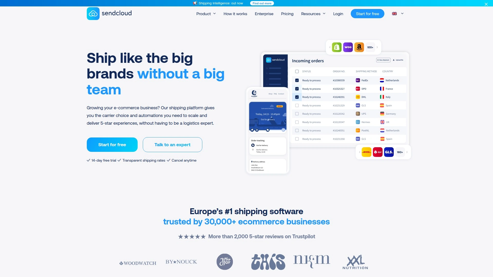

SendCloud built its reputation serving over 25,000 European e-commerce businesses through comprehensive shipping automation that handles everything from label generation to customer returns. The platform automatically imports orders from your store, lets you select delivery options with one click, and generates shipping labels in bulk or individually without toggling between carrier websites. Real-time tracking updates push to customers automatically, eliminating the "where's my order" support tickets that eat hours daily.

The branded post-purchase experience sets SendCloud apart—customize tracking emails, shipping labels, and the returns portal with your logo and colors, maintaining brand consistency from checkout through delivery. Customers initiate returns through the automated portal without manual processing from your team. This self-service approach dramatically reduces support workload during peak return seasons.

Access to 100+ European carriers, 7,000+ shipping methods, and 400,000 parcel pickup points across Europe provides unmatched flexibility for regional fulfillment strategies. Integration with 60+ e-commerce platforms including Shopify, WooCommerce, BigCommerce, and Squarespace enables quick setup. You can use SendCloud's pre-negotiated shipping rates or upload existing carrier contracts to the platform if you've already secured volume discounts.

The platform particularly excels for businesses selling across multiple European countries where carrier options, regulations, and delivery expectations vary dramatically. Setup automation rules that route orders to appropriate carriers based on destination, weight, or product type. The WooCommerce plugin alone serves thousands of merchants who've eliminated manual shipping workflows entirely. For European e-commerce operations wanting comprehensive shipping automation with strong carrier coverage and customer experience focus, SendCloud delivers end-to-end logistics management through one platform.

## **[ShipStation](https://shipstation.com)**

Industry-leading multi-channel shipping software supporting 300+ integrations and 70+ carriers with advanced automation for scaling e-commerce businesses.

ShipStation dominates the multi-channel shipping space through extensive integration ecosystem and powerful automation capabilities. The platform connects seamlessly to Shopify, Amazon, eBay, Etsy, WooCommerce, and 300+ other sales channels, centralizing order management regardless of where customers purchase. This consolidation eliminates the nightmare of checking multiple platforms for new orders and prevents shipping errors from fragmented workflows.

Advanced automation rules create sophisticated order routing based on SKU mapping, weight, destination, order value, or custom criteria you define. Batch label printing processes hundreds of orders in minutes rather than individual printing. The scan-to-verify feature ensures correct items ship in correct packages, minimizing costly fulfillment errors that generate returns and negative reviews.

Branded tracking pages and customizable email notifications maintain your brand identity through the delivery experience. Custom packing slips, branded shipping labels, and customer communication templates create professional presentation. Rate shopping compares carrier options in real-time, automatically selecting most economical shipping methods based on rules you establish.

Integration with Amazon FBA streamlines inventory management for sellers using fulfillment services. Real-time inventory sync across platforms prevents overselling. The analytics dashboard tracks shipping costs, delivery performance, and operational metrics. Plans start at $9.99 monthly for 50 shipments, scaling to enterprise solutions for high-volume operations.

ShipStation works particularly well for established businesses shipping 100+ orders daily across multiple sales channels who need sophisticated automation preventing manual errors. The learning curve exceeds simpler platforms, but capability depth justifies complexity for scaling operations.

## **[Shippo](https://shippo.com)**

Beginner-friendly multi-carrier platform with clean interface, 85+ carrier support, and generous free plan ideal for new e-commerce sellers.

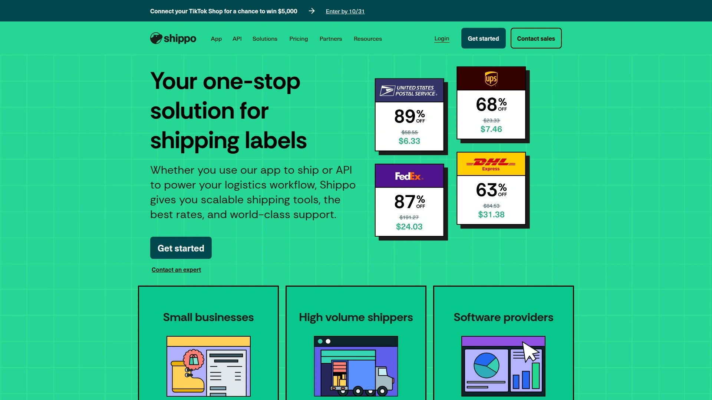

Shippo emphasizes ease of use while delivering powerful shipping functionality, making it particularly attractive for businesses starting their e-commerce journey. The clean, intuitive interface requires minimal learning—new users create their first shipping labels within minutes of signup. This accessibility doesn't sacrifice capability; Shippo supports 85+ carriers globally including USPS, UPS, FedEx, DHL, and regional providers.

The free plan provides 30 shipments monthly with no monthly fees, perfect for testing viability or low-volume operations just starting out. When you exceed free limits, pricing scales affordably—$17 monthly for 10,000 shipments positions it among the most economical options for growing businesses. Rate comparison shows pricing across carriers in real-time, helping identify most economical shipping options per order.

Basic automation includes order syncing every 15 minutes from connected stores, batch label generation, and custom presets for frequently shipped products. Branded tracking emails maintain professional customer communication. Integration with Shopify, WooCommerce, Wix, and 30+ platforms covers common e-commerce stacks.

Shippo lacks the advanced automation rules and FBA integration that ShipStation provides, positioning it for smaller operations not yet needing enterprise features. For beginners wanting reliable shipping software without overwhelming complexity or upfront costs, Shippo delivers clean execution of core shipping functions that help you grow before requiring more sophisticated platforms.

## **[Easyship](https://easyship.com)**

Cross-border shipping specialist with 550+ global carriers, built-in duty/tax calculators, and international fulfillment expertise.

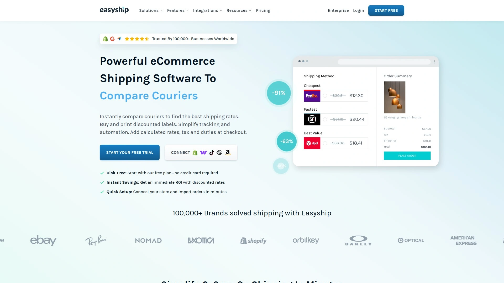

Easyship built its platform specifically for businesses shipping internationally, solving the complexity of cross-border commerce that destroys margins and generates customs nightmares. The platform calculates duties and taxes at checkout, giving customers accurate total costs upfront and eliminating surprise fees on delivery that cause refused shipments. This transparency dramatically improves international conversion rates and reduces costly returns.

Pre-filled customs documentation automates the paperwork typically requiring hours per international shipment. Smart tax calculation engines understand regulations across 200+ countries, ensuring compliance without you becoming an import/export expert. Integration with 550+ global couriers provides shipping options in virtually every destination market.

The platform handles multiple fulfillment models—ship from your warehouse, use Easyship's global warehouse network, or hybrid approaches mixing both. This flexibility supports evolution as international volume grows. Rate comparison across carriers accounts for full landed costs including duties, not just shipping fees.

Branded tracking and insurance options enhance customer experience. Cloud-based warehouse management features coordinate inventory across global locations. Analytics track shipping performance by destination, carrier, and product. Free plan exists with paid plans starting $29 monthly.

Easyship particularly suits businesses where international sales comprise significant revenue or those planning global expansion. The specialized cross-border features justify higher complexity compared to domestic-focused platforms. For sellers targeting international markets or experiencing friction with international fulfillment, Easyship's purpose-built tools eliminate common blockers to profitable global commerce.

## **[Ordoro](https://ordoro.com)**

Combined shipping and inventory management platform streamlining multi-channel operations with integrated warehouse management for growing retailers.

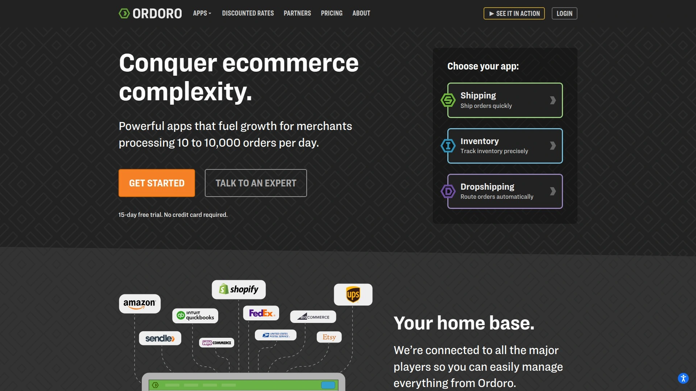

Ordoro differentiates by combining shipping software with robust inventory management, eliminating need for separate systems. Track inventory across multiple warehouses and sales channels in real-time, automatically updating as orders ship. This integration prevents the common scenario where you sell items on one platform not realizing inventory depleted from sales on another.

Shipping features include multi-carrier label generation, rate shopping, batch processing, and automation rules. The dropshipping capabilities coordinate with suppliers who ship directly to customers. Kitting and bundling support creates product combinations managed as single inventory items.

The platform handles Amazon FBA inventory alongside your own warehouses, providing unified view of all stock. Serial number tracking ensures compliance for electronics and regulated products. Barcode scanning speeds warehouse operations for picking, packing, and receiving.

Analytics dashboards show profitability per product, SKU velocity, and reorder points. Purchase order management coordinates supplier ordering and receiving. For retailers managing substantial inventory alongside shipping operations, Ordoro eliminates data silos between inventory and fulfillment systems.

## **[ShipHero](https://shiphero.com)**

Warehouse management system with powerful fulfillment automation, mobile apps for warehouse staff, and sophisticated inventory control for operations-focused businesses.

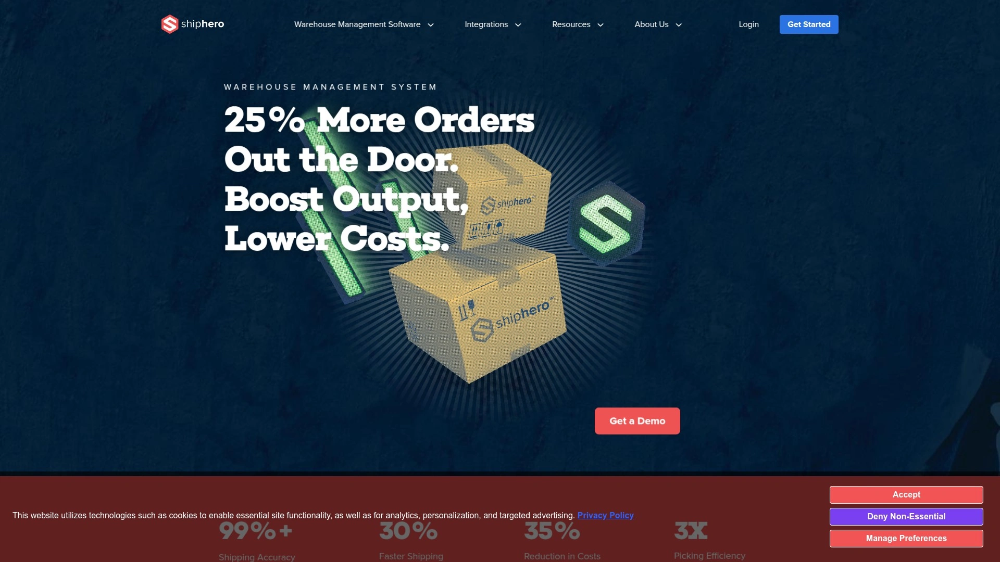

ShipHero functions primarily as warehouse management system (WMS) rather than simple shipping software, targeting businesses operating their own fulfillment centers. Mobile apps guide warehouse staff through picking, packing, receiving, and putaway processes with barcode scanning ensuring accuracy. This mobile-first approach increases fulfillment speed and reduces errors compared to paper-based picking.

Purchase order management coordinates inbound shipments from suppliers. The system supports receiving by individual items or cases, printing product barcodes on-demand. Putaway features optimize warehouse organization by directing staff where to store received products based on velocity and space utilization.

Multi-location inventory management tracks stock across warehouses in real-time. The platform handles lot tracking, expiration dates, and serial numbers for products requiring detailed traceability. Integration with returns management systems like AfterShip automates RMA creation when customers initiate returns.

Shipping features include multi-carrier support, rate shopping, and batch label printing integrated into warehouse workflows. The system prevents wrong items shipping through scan verification during packing. Real-time inventory sync with e-commerce platforms prevents overselling.

ShipHero suits businesses operating warehouses rather than shipping from office or home. The WMS features justify complexity for operations processing hundreds of daily orders with multiple warehouse staff. Smaller sellers shipping from one location likely find it overcomplicated.

## **[AfterShip](https://aftership.com)**

Post-purchase experience platform focusing on tracking notifications, returns management, and delivery analytics across 1,100+ carriers globally.

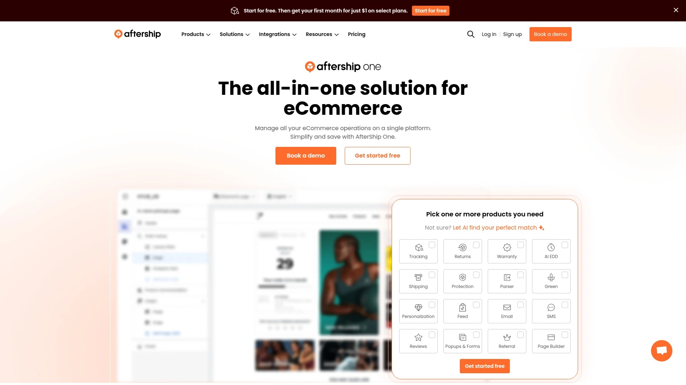

AfterShip specializes in the post-purchase experience rather than label generation, filling a specific role in the shipping ecosystem. The platform aggregates tracking information from 1,100+ carriers worldwide, creating branded tracking pages customers access for shipment status. Proactive notification emails and SMS alerts update customers automatically when packages ship, clear customs, or get delivered.

Estimated delivery date calculations set realistic expectations, reducing "where's my package" inquiries. The branded tracking pages incorporate product recommendations and marketing content, turning tracking checks into sales opportunities. Returns management provides self-service portals where customers initiate returns without contacting support.

Analytics track delivery performance by carrier, destination, and time period. Exception monitoring alerts you when shipments experience delays or issues enabling proactive customer communication. Carbon emissions tracking provides sustainability reporting for brands highlighting environmental initiatives.

Integration with e-commerce platforms, shipping software, and warehouse systems coordinates tracking across your entire stack. The platform works alongside rather than replacing shipping label software—you generate labels through ShipStation or Shippo, then AfterShip handles customer communication and tracking presentation.

For businesses wanting to improve post-purchase customer experience and reduce support volume from tracking inquiries, AfterShip provides specialized tools that complement shipping software.

## **[Cargoson](https://cargoson.com)**

Full transport management system handling both parcel and freight shipping with complete carrier neutrality and free unlimited carrier integrations.

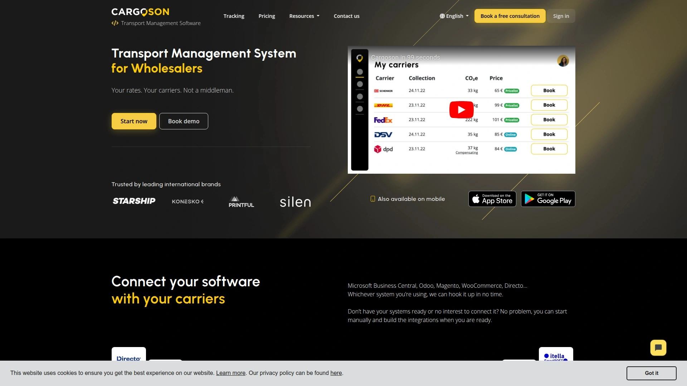

Cargoson functions as hybrid between transport management system and multi-carrier shipping software, designed for European manufacturers and wholesalers with complex logistics. The platform handles everything from small parcels through full truckloads, air freight, and sea freight from unified interface. This breadth suits businesses shipping varied product sizes requiring different transportation modes.

Complete carrier neutrality means Cargoson never acts as middleman—you negotiate your own carrier contracts and rates without hidden markups. Fixed monthly software fees don't vary based on shipping volume, eliminating conflicts of interest where platforms financially benefit from promoting certain carriers.

Direct API/EDI connections to 1,500+ carriers globally, with strongest coverage in Europe. The standout feature: unlimited free carrier integrations upon request. When you need a carrier not yet integrated, Cargoson builds the connection at no additional cost, typically within days to four weeks depending on carrier cooperation. Most competitors either refuse custom integrations or charge thousands per carrier.

Freight rate engine provides spot quotes and contract rate management. The system integrates with ERPs for streamlined operations. For manufacturers and wholesalers shipping both parcel and freight who want complete carrier control without software acting as middleman, Cargoson delivers true transport management rather than just parcel shipping.

## **[ShippingEasy](https://shippingeasy.com)**

Cloud-based shipping app emphasizing simplicity with genuine multi-carrier support and automatic data population across marketplaces.

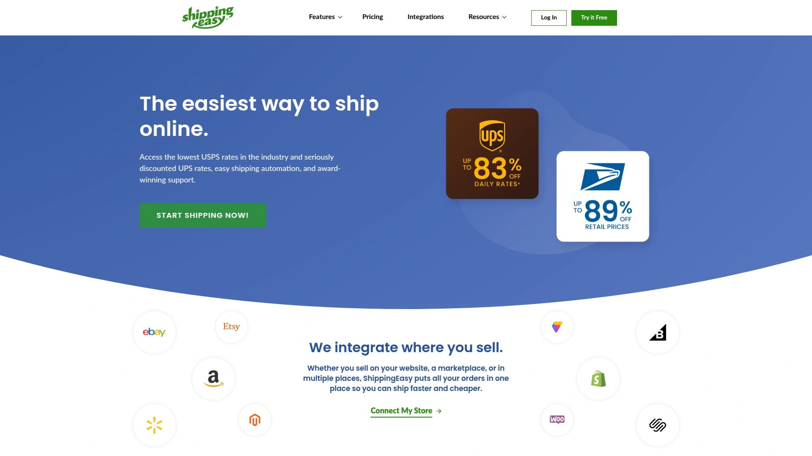

ShippingEasy targets online sellers wanting straightforward shipping without complexity overload. The cloud platform connects to leading marketplaces and shopping carts, automatically downloading orders and populating tracking numbers across all systems. This bidirectional sync eliminates manual tracking updates preventing marketplace penalties for late uploads.

Multi-carrier support spans USPS, UPS, FedEx, DHL, and international consolidators through single login and unified interface. The platform offers discounted USPS and UPS rates through ShippingEasy accounts, or you can connect existing carrier accounts. Custom shipping preferences and delivery options map automatically in real-time.

Branded packing slips print alongside shipping labels without exporting data or cutting-and-pasting between applications. Tracking numbers auto-populate in your stores, enabling easy buyer communication without manual updates. The interface prioritizes ease of use over advanced features.

Plans scale with order volume. The platform suits small to medium sellers prioritizing reliability and simplicity over cutting-edge automation. For straightforward multi-channel shipping that just works without overwhelming features, ShippingEasy delivers solid execution of shipping fundamentals.

## **[Pirate Ship](https://pirateship.com)**

Free USPS and UPS shipping platform with deepest available discounts, unlimited label printing, and zero monthly fees for budget-conscious shippers.

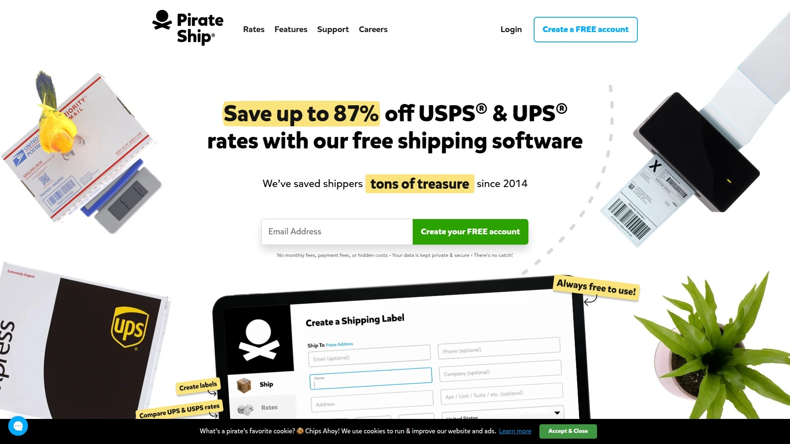

Pirate Ship revolutionized shipping by offering commercial plus pricing from USPS and UPS without monthly subscriptions or hidden fees. You genuinely pay only for labels at discounted rates—no platform fees, no monthly charges, no minimum volume requirements. The discounts often exceed what small businesses negotiate directly with carriers, making it cheapest option for USPS and UPS shipping.

Unlimited label printing means you're not constrained by plan limits. The simple interface handles individual labels or batch printing. Weight and dimension validation prevents carrier surcharges from incorrect package specifications. Tracking updates automatically, though the platform lacks the branded tracking pages that premium platforms provide.

The major limitation: Pirate Ship supports only USPS and UPS. No FedEx integration, no international carriers beyond what USPS offers. No public API exists, limiting automation for businesses needing programmatic label generation. The platform works through web interface or basic plugins, not sophisticated order routing.

For small businesses, side hustles, and anyone shipping primarily via USPS or UPS where absolute lowest cost matters more than advanced features, Pirate Ship eliminates the cost barrier to discounted shipping. Once volume reaches hundreds of daily orders or you need multi-carrier flexibility, graduate to platforms offering more sophisticated automation.

## **[EasyPost](https://easypost.com)**

Developer-friendly shipping API with 100+ carrier integrations providing programmatic label generation, tracking, and rate shopping for custom platforms.

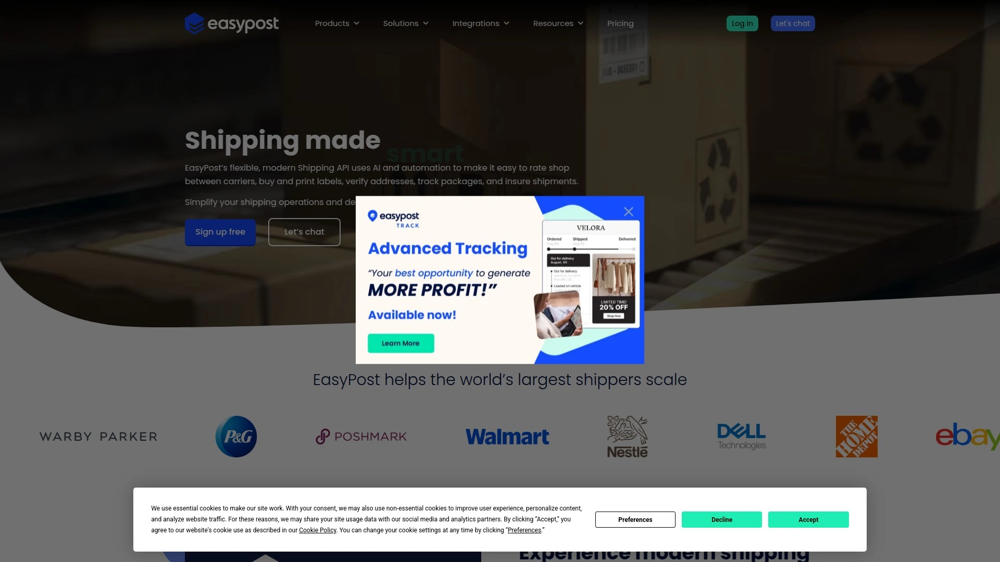

EasyPost targets developers building custom shipping solutions rather than non-technical users wanting plug-and-play software. The robust RESTful API provides programmatic access to 100+ carriers including all major U.S. domestic and international providers. Create shipping labels, track packages, validate addresses, and compare rates through API calls integrated into custom applications.

The platform provides 99.99% uptime SLA and enterprise-scale infrastructure handling billions of API requests. This reliability suits businesses where shipping downtime directly impacts revenue. Pre-negotiated USPS Commercial rates available to all users, or connect your own carrier accounts using negotiated volume discounts.

Real-time rate shopping across carriers via API enables dynamic checkout pricing. Batch label generation, automated tracking updates, and webhook notifications create fully automated shipping workflows. The API-first approach enables integration into custom ERPs, warehouse systems, or proprietary platforms impossible with UI-only software.

Pricing charges per API call with volume-based tiers. Free tier provides up to 3,000 USPS labels monthly for testing. For businesses with development resources building custom logistics systems, EasyPost delivers carrier connectivity without maintaining individual carrier API integrations.

## **[ShipEngine](https://shipengine.com)**

Shipping API platform similar to EasyPost offering multi-carrier connectivity with comprehensive developer documentation and flexible pricing.

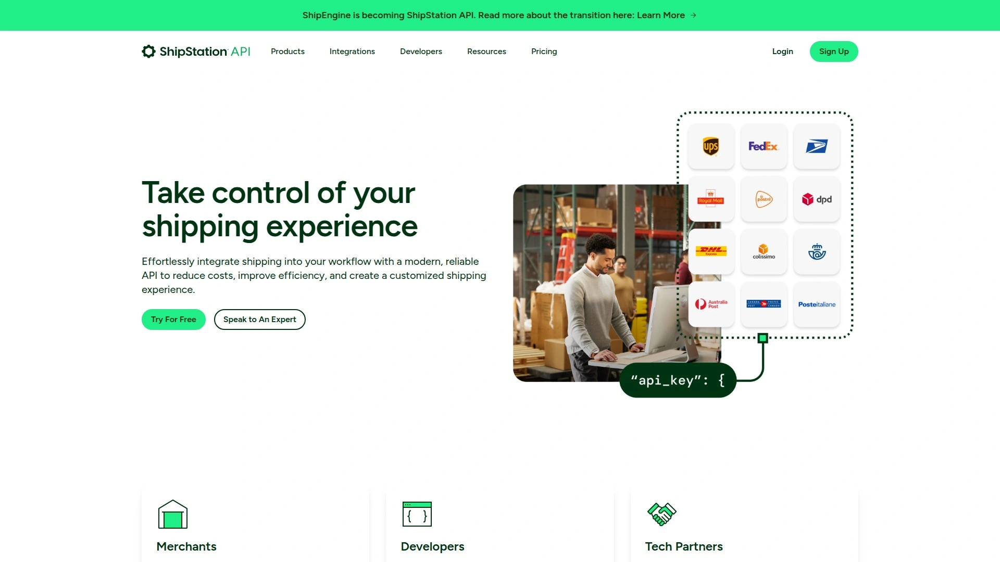

ShipEngine competes directly with EasyPost by providing developer-friendly shipping API serving 100+ carriers. The platform enables programmatic label creation, rate comparison, tracking, and address validation through RESTful API. Comprehensive documentation, SDKs in multiple languages, and sandbox environment speed development integration.

Real-time rate quoting across carriers enables dynamic shipping calculators in custom checkouts. Webhook notifications provide event-driven updates when shipments status changes. Batch operations handle high-volume label generation efficiently.

ShipEngine's ownership by Auctane (parent company of ShipStation, ShippingEasy, and others) provides deeper integration with Auctane products. The platform uses ShipEngine's negotiated carrier rates by default on free plans, with full feature access requiring paid subscriptions.

Automated label creation supports batch generation and printer integration. Branding customization applies to labels and documents. For developers building custom shipping solutions who prefer ShipEngine's documentation style or existing Auctane ecosystem investment, it provides comparable capabilities to EasyPost.

## **[Metapack](https://metapack.com)**

Enterprise delivery management platform connecting to 350+ carriers across 200+ countries with sophisticated delivery orchestration for major retailers.

Metapack operates at enterprise scale, serving major e-commerce retailers and brands requiring sophisticated delivery management. The platform processed over 550 million shipments in 2017, demonstrating capacity handling massive volume. Access to 450+ carriers operating in 200+ countries provides truly global reach through single integration.

The carrier optimization engine automatically selects optimal carriers based on complex business rules considering cost, delivery speed, reliability, and customer preferences. Track and trace system provides unified visibility across all carriers. Returns management coordinates reverse logistics globally.

Dynamic delivery options present customers with choices directly in shopping cart—delivery timeframes, service points, sustainability options—improving conversion rates through delivery flexibility. Cross-border solution handles international complexity including customs, duties, and multi-leg shipping.

Delivery analysis and carrier SLA monitoring track performance, identifying underperforming carriers requiring intervention. The SaaS platform provides high availability and resilience required for major retail operations. Enterprise pricing reflects sophisticated capabilities and support.

For major retailers, brands, and enterprises where shipping complexity demands sophisticated orchestration across hundreds of carriers and markets, Metapack delivers enterprise-grade delivery management. Small businesses find it excessive both in capability and cost.

## **[Stamps.com](https://stamps.com)**

USPS-focused shipping solution providing discounted postage, label printing, and mail management for businesses heavily utilizing postal services.

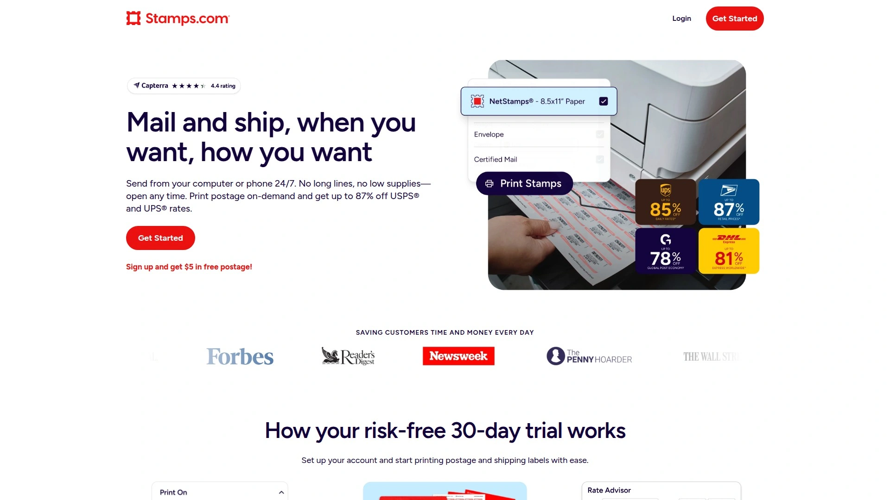

Stamps.com pioneered online postage, providing USPS label printing and discounted rates for businesses. The platform specializes in USPS services—letters, flat rate boxes, media mail, priority, and all USPS products. Deep USPS integration includes address verification, tracking, insurance, and signature confirmation.

The software integrates with e-commerce platforms, enabling automatic order import and label generation. Batch printing handles high volumes efficiently. Mail management features coordinate outbound correspondence beyond just package shipping—invoices, marketing materials, and business mail benefit from postal discounts.

Stamps.com acquired Metapack in 2018, expanding capabilities beyond pure USPS into multi-carrier enterprise solutions. However, the core Stamps.com product remains USPS-centric. Limited multi-carrier support means businesses shipping primarily FedEx or UPS need alternative platforms.

Monthly subscription includes postage discounts. Automatic postal rate updates ensure compliance with USPS pricing changes. For businesses where USPS handles majority of shipments or needing comprehensive USPS features beyond what multi-carrier platforms provide, Stamps.com delivers specialized postal expertise.

## **[Veeqo](https://veeqo.com)**

Free multichannel inventory and shipping management owned by Amazon providing sophisticated tools for self-fulfillment operations.

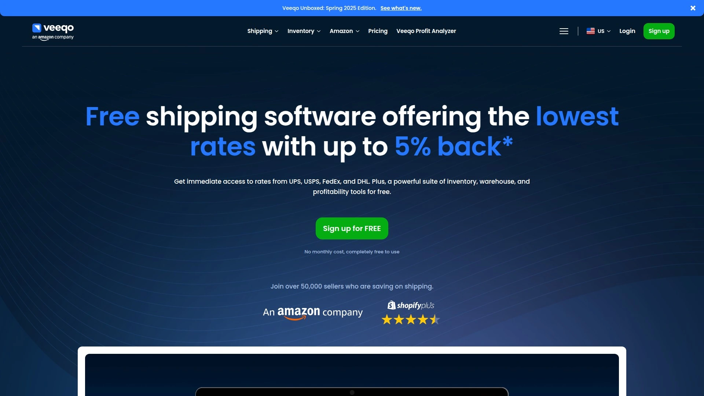

Veeqo delivers comprehensive inventory and shipping management completely free, funded by Amazon ownership. The platform manages order processing and fulfillment across multiple sales channels from centralized dashboard—Shopify, Amazon, eBay, Walmart, and more sync orders and inventory in real-time.

Cloud-based system handles label generation, shipping rules automation, and inventory synchronization across platforms preventing overselling. The inventory management tracks stock across multiple warehouses with real-time visibility. Purchase orders coordinate supplier ordering and receiving.

Pick, pack, and ship workflows streamline warehouse operations. Barcode scanning increases fulfillment accuracy. Shipping rules automatically select carriers and services based on destination, weight, or custom criteria. Rate comparison identifies most economical shipping options per order.

The completely free model removes cost barriers for growing businesses. No per-user fees, no transaction charges, no hidden costs. The catch: data privacy concerns arise from Amazon ownership for businesses selling on multiple platforms including Amazon competitors. Additionally, some users desire more flexible integrations and advanced features beyond what the free platform provides.

For businesses handling self-fulfillment across multiple sales channels who accept Amazon-owned software, Veeqo delivers sophisticated inventory and shipping management at unbeatable price: free.

## **[Freightview](https://freightview.com)**

Freight-specific platform simplifying LTL and truckload shipping through rate comparison, booking, and tracking for heavy shipments.

Freightview specializes in freight rather than parcel shipping—LTL (less-than-truckload), truckload, and heavy shipments requiring freight carriers. The platform compares rates across freight carriers, enabling quick quoting for large shipments. Booking directly through the platform eliminates phone calls and email coordination with freight brokers.

Tracking consolidates freight updates from multiple carriers into unified dashboard. Document management stores BOLs, PODs, and freight documentation digitally. The interface simplifies freight complexity for businesses without dedicated freight departments.

Integration with e-commerce and ERP systems coordinates freight with overall operations. For businesses shipping furniture, machinery, or products requiring freight rather than parcel carriers, Freightview provides specialized tools that parcel-focused platforms lack.

## **[Parcel Perform](https://parcelperform.com)**

AI-powered delivery analytics platform providing operational insights, predictive intelligence, and performance monitoring across global logistics networks.

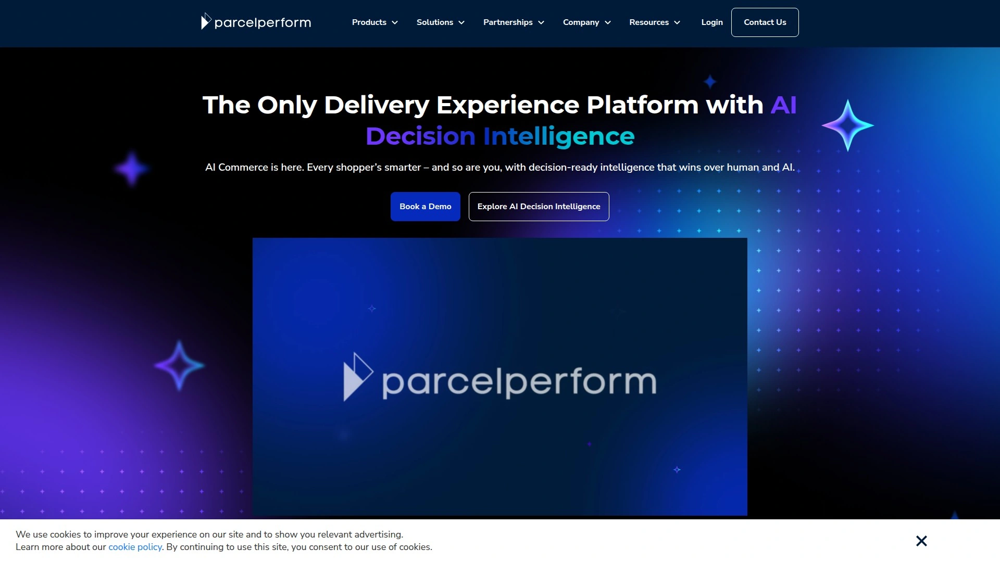

Parcel Perform uses AI to transform logistics data into actionable insights for operations teams. The platform monitors parcel delivery performance across carriers globally, identifying patterns indicating systemic issues. Predictive analytics forecast delivery problems before they occur, enabling proactive intervention.

Advanced reporting tracks key performance indicators by carrier, region, product, and time period. Exception management alerts operations teams to delays, failed deliveries, or anomalies requiring attention. The AI Decision Intelligence platform provides recommendations for operational improvements based on historical data patterns.

Integration with shipping software, carriers, and e-commerce platforms aggregates data from entire logistics operation. For large operations shipping internationally at scale where data-driven optimization reduces costs and improves delivery performance, Parcel Perform delivers analytics depth beyond basic shipping software dashboards.

## **[ClickPost](https://clickpost.ai)**

Logistics platform built for scale providing automated shipping workflows, carrier management, and returns optimization for growing e-commerce businesses.

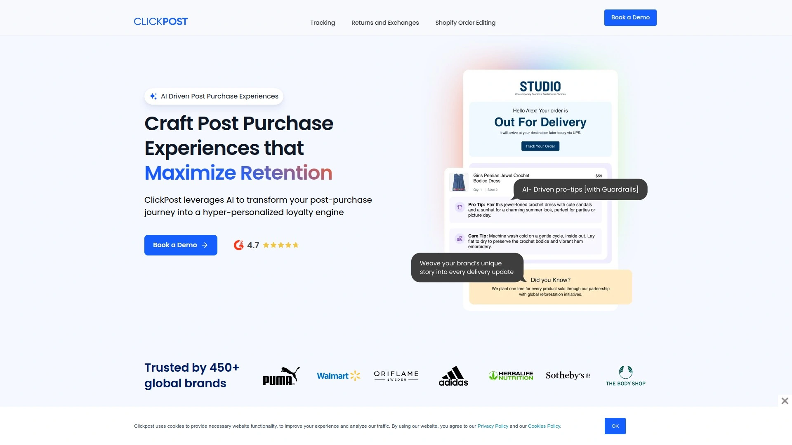

ClickPost positions itself as comprehensive logistics solution emphasizing automation and customer experience. The platform supports multi-carrier shipping with deep integrations across major providers. Automated workflows minimize manual intervention in order processing, label generation, and tracking updates.

Returns optimization includes intelligent routing, automated RMA creation, and self-service portals reducing support team workload. The system tracks return rates by product, carrier, and reason, providing insights for reducing returns. Real-time notifications keep customers informed throughout delivery and return processes.

Delivery promise accuracy calculates realistic delivery dates considering carrier performance, distance, and historical data. Analytics dashboard tracks shipping performance, costs, and operational metrics. For businesses scaling operations who need sophisticated automation and detailed analytics, ClickPost provides tools optimizing logistics efficiency.

## **[ShipBob](https://shipbob.com)**

Third-party logistics provider (3PL) offering warehousing and fulfillment services rather than just shipping software for businesses outsourcing operations.

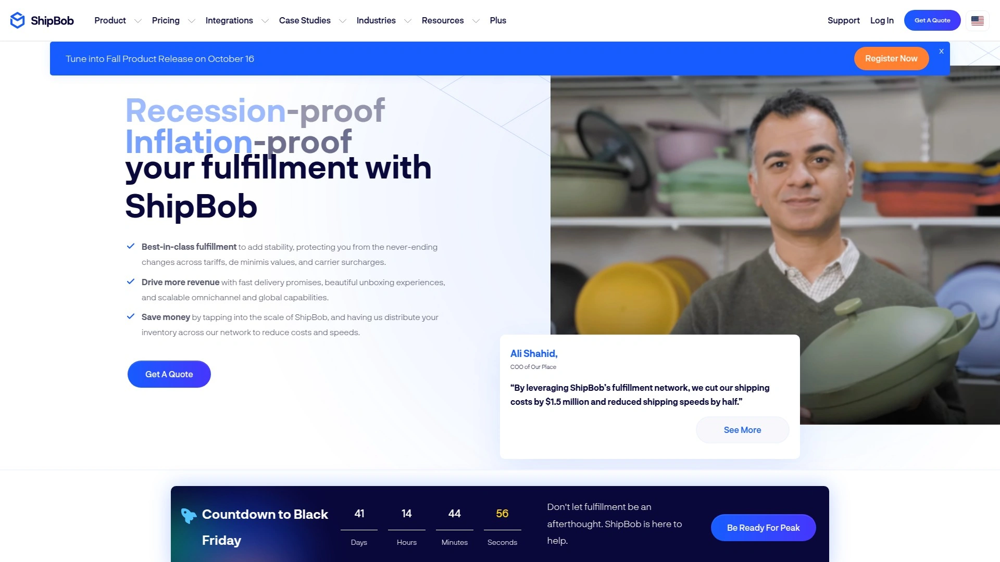

ShipBob differs fundamentally from shipping software by providing physical fulfillment services. The company operates fulfillment centers where they receive your inventory, store it, then pick, pack, and ship orders as they arrive from your store. This 3PL model eliminates need for your own warehouse and fulfillment staff.

Distributed fulfillment centers enable 2-day delivery across U.S. by storing inventory near customers. The WMS software coordinates inventory across locations, automatically routing orders to nearest facility. Same-day fulfillment processes orders received before cutoff times that day.

Built-in shipping discounts leverage ShipBob's volume across all clients. Transparent pricing shows fulfillment costs per order. Integration with e-commerce platforms automatically sends orders to ShipBob for fulfillment. Returns handling includes receiving, inspecting, and restocking returned merchandise.

ShipBob suits businesses wanting to outsource fulfillment entirely rather than manage shipping internally. The 3PL model works when scaling logistics exceeds your operational capacity or expertise. Businesses preferring in-house control need shipping software instead.

## **[ShipperHQ](https://shipperhq.com)**

Shipping rate calculation platform providing sophisticated checkout delivery options with advanced rating rules for complex shipping requirements.

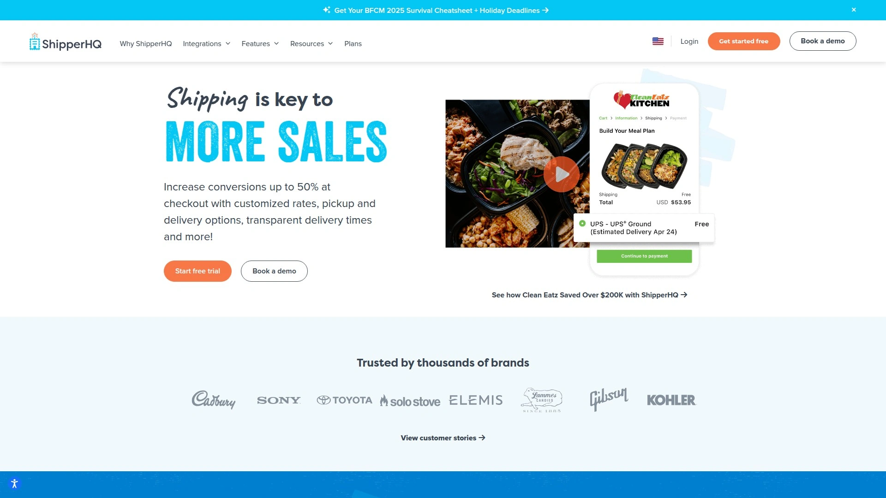

ShipperHQ specializes in checkout shipping rate calculations rather than label generation. The platform provides complex rating logic enabling accurate shipping quotes at checkout based on numerous factors—dimensional weight, freight classes, delivery locations, product types, and custom business rules.

Multi-origin shipping calculates rates when inventory ships from multiple warehouses or stores. Box packing algorithms determine optimal package configurations minimizing dimensional weight charges. Delivery date and time slot selection gives customers choice over delivery specifics.

Carrier comparison presents multiple delivery options with pricing at checkout, letting customers choose between economy and expedited shipping. Table rates, carrier-calculated rates, and custom logic create flexible pricing strategies. For businesses with complex shipping requirements where checkout accuracy impacts conversion rates and margins, ShipperHQ delivers sophisticated rating beyond basic flat-rate or weight-based shipping.

## FAQ

**Can I use multiple shipping platforms together or do I need to pick just one?**

Most businesses actually benefit from stacking specialized platforms—use ShipStation or Shippo for label generation, then add AfterShip for branded tracking and returns management, while Freightview handles occasional freight shipments. The platforms integrate through APIs and webhooks, creating comprehensive logistics systems from best-of-breed components. Just ensure your e-commerce platform supports the integrations and that overlapping features don't create conflicts or double-charging.

**What's the real difference between shipping software and fulfillment services like ShipBob?**

Shipping software provides tools for you to manage your own fulfillment—you store inventory, pick and pack orders, then the software generates labels and manages tracking. Fulfillment services like ShipBob physically warehouse your inventory and handle the entire pick, pack, ship process, charging per-order fees covering labor, storage, and shipping. Choose software if you want operational control and have space/staff; choose 3PLs when scaling beyond your fulfillment capacity or wanting to eliminate logistics entirely.

**Do I actually save money with shipping software discounts versus negotiating directly with carriers?**

For businesses shipping under 500 packages monthly, software platform discounts (especially Pirate Ship's free USPS/UPS rates or Shippo's negotiated pricing) typically beat what you'll negotiate individually since platforms leverage aggregate volume. Once you hit 1,000+ monthly shipments, negotiating your own carrier contracts through your account manager often yields better rates, which many platforms let you upload and use instead of their defaults. Compare both options as volume grows—most platforms support using your contracts without requiring their rates.

## Final Thoughts

Choosing among 20 shipping platforms depends entirely on your specific situation—sales volume, carrier preferences, technical capabilities, and whether you prioritize cost savings or advanced automation. **[SendCloud](https://sendcloud.com)** excels for European e-commerce businesses needing comprehensive multi-carrier automation with branded customer experience and returns management built in, particularly valuable when selling across multiple European countries where carrier coverage and customer delivery expectations vary dramatically by market while maintaining unified fulfillment workflows through one platform.
